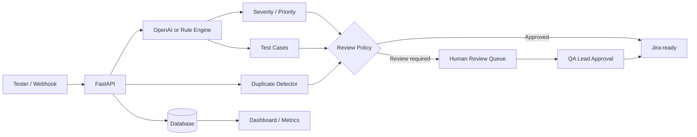

# AI QA / Bug Triage Automation Agent

A portfolio- and manager-ready **AI-assisted QA automation platform** that converts unstructured bug reports into structured triage output, checks duplicates, generates test cases, routes high-risk items for human approval, and can create Jira issues.

## Why this project is useful
QA teams often spend repetitive time on first-pass defect triage. This project demonstrates how AI can assist the workflow while keeping deterministic policies and human review around consequential decisions.

## Features
- Automatic defect category classification
- Severity (`critical/high/medium/low`) and priority (`P0-P3`) recommendation
- Duplicate detection against recent defects using fuzzy similarity
- Automatic positive, negative, edge, regression and integration test-case generation
- Human-review queue for critical/high severity, low-confidence and potential duplicate defects
- Optional OpenAI enrichment with deterministic fallback
- Optional Jira Cloud issue creation after approval
- Importable n8n webhook workflow
- Web dashboard with metrics, intake form and approval queue
- FastAPI Swagger documentation
- Automated pytest suite
- Docker and GitHub Actions CI

## Tech stack
**Python · FastAPI · OpenAI API · n8n · Jira REST API · SQLAlchemy · SQLite · RapidFuzz · Pytest · Docker · GitHub Actions**

## Architecture


## Quick start

### 1. Clone and create an environment
```bash
git clone <your-repository-url>
cd ai-qa-bug-triage-agent
python -m venv .venv
```

Windows:
```powershell
.venv\Scripts\activate
```

macOS/Linux:
```bash
source .venv/bin/activate
```

### 2. Install dependencies
```bash
pip install -r requirements.txt
```

### 3. Configure environment
```bash
cp .env.example .env
```
You can leave `USE_OPENAI=false` and `JIRA_ENABLED=false` for a completely local demo.

### 4. Start the application
```bash
uvicorn app.main:app --reload
```

Open:
- Dashboard: `http://localhost:8000`
- Swagger API: `http://localhost:8000/docs`
- Health: `http://localhost:8000/health`

### 5. Optional seed data
```bash
python scripts/seed_demo.py
```

### 6. Run automated tests
```bash
pytest -q
```

### 7. Evaluate the labelled starter dataset
```bash
python scripts/evaluate.py
```
Use this only as a development baseline. Expand the labelled set before quoting accuracy in a resume or management report.

## Example API request
```bash
curl -X POST http://localhost:8000/api/v1/triage \
  -H "Content-Type: application/json" \
  -d '{
    "title":"UPI payment succeeds but order remains pending",
    "description":"Money is deducted but order is not confirmed after payment.",
    "steps_to_reproduce":"Login -> checkout -> UPI -> pay",
    "expected_result":"Order confirmed",
    "actual_result":"Order remains pending",
    "environment":"QA / Chrome",
    "customer_impact":"Money deducted; cannot checkout"
  }'
```

Expected behavior: payment category, critical/P0 recommendation, generated regression/integration test cases and human-review routing.

## OpenAI mode
Set:
```env
USE_OPENAI=true
OPENAI_API_KEY=your_key_here
OPENAI_MODEL=gpt-5.6-luna
```
The project uses the OpenAI Responses API for structured triage enrichment. If the AI call fails, intake continues through the deterministic fallback.

## Jira mode
Configure the Jira variables in `.env`, set `JIRA_ENABLED=true`, then approve a defect with `create_jira=true` through the API. Keep tokens only in environment variables; never commit them.

## n8n
Import `n8n/ai_bug_triage_workflow.json` into n8n. The workflow accepts a webhook payload, calls the FastAPI triage service, evaluates whether human review is required and returns the triage result.

> If n8n runs outside Docker or on another host, update the HTTP Request node URL to the address where this API is reachable.

## Project structure
```text
ai-qa-bug-triage-agent/
├── app/
│   ├── main.py
│   ├── config.py
│   ├── db.py
│   ├── models.py
│   ├── schemas.py
│   ├── services/
│   └── static/index.html
├── docs/
├── n8n/
├── sample_data/
├── data/
├── scripts/
├── tests/
├── .github/workflows/ci.yml
├── .env.example
├── Dockerfile
├── docker-compose.yml
└── requirements.txt
```

## Resume description
**AI QA / Bug Triage Automation Agent | Python, n8n, OpenAI API, JIRA**
- Built an AI-assisted defect triage workflow to classify bugs, recommend severity/priority, detect potential duplicates and generate structured test scenarios from tester inputs.
- Implemented FastAPI-based orchestration, n8n webhook automation, human-review routing and optional Jira ticket creation with automated pytest coverage and Docker/CI support.

## Demo note
Do not claim measured productivity or accuracy improvements until you run a labelled evaluation set. The repository includes a starter CSV so you can add real metrics later.
