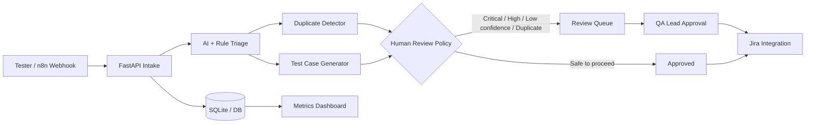

# Project Report

## Project
**AI QA / Bug Triage Automation Agent**

## Problem statement
QA teams repeatedly spend time converting unstructured bug reports into actionable defects: classification, severity/priority, duplicate checks, test coverage suggestions and ticket routing. Inconsistent triage can delay fixes and create duplicate engineering effort.

## Solution
A FastAPI-based service that accepts a bug report, performs AI-assisted or deterministic triage, checks recent defects for similarity, generates structured test cases, applies a human-review policy, exposes metrics and can create Jira issues after approval.

## Architecture

## Major modules
- Bug intake and validation
- AI analysis with deterministic fallback
- Severity / priority policy
- Duplicate detection using fuzzy text similarity
- Test-case generation
- Human review queue
- Jira Cloud integration
- n8n webhook orchestration
- Dashboard and metrics
- Pytest automated test suite
- Docker and GitHub Actions CI

## Security and governance
- Secrets are read from environment variables and excluded from Git.
- High-impact defects require human approval by default.
- AI root-cause output is explicitly described as an investigation hint rather than confirmed cause.
- Jira integration can be disabled for safe demonstrations.
